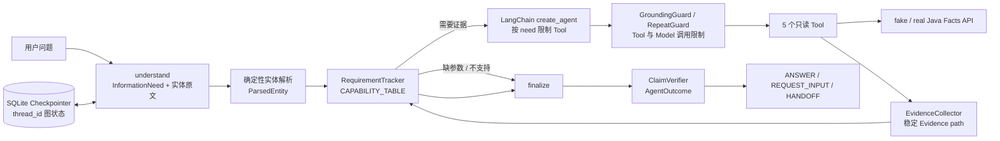

# Group Buy Agent

Group Buy Agent 是阶段 A 的拼团业务诊断原型：使用真实大模型理解用户需求，通过 5 个只读 Tool 查询订单、活动、资格、可加入团队和规则，并用可追溯 Evidence 约束最终结论。当前实现聚焦查询与诊断，不执行订单修改、退款到账确认等写操作或超出能力范围的任务。

## 阶段 A 架构



核心约束：Tool 参数必须来自用户原文解析出的可信实体或已有可信 Observation；FACT / RULE Claim 必须引用真实存在且类型匹配的 Evidence path。

## 启动方式

要求 Python 3.11 或更高版本。

```powershell
python -m pip install -e .
Copy-Item .env.example .env
```

在本地 `.env` 中填写真实的 OpenAI 兼容接口地址、模型名和 API Key，然后启动开发用 Facts 服务：

```powershell
python -m uvicorn fake_java.main:app --host 127.0.0.1 --port 8000
```

另开终端运行 CLI：

```powershell
python cli.py "订单 ORD100001 现在什么状态"
```

启动只提供 SSE 的 FastAPI 接口：

```powershell
$env:JWT_SECRET = "replace-with-a-long-random-secret"
python -m uvicorn api:app --host 127.0.0.1 --port 8080
```

使用 `curl -N` 关闭客户端响应缓冲，可以立即看到执行进度：

```powershell
curl.exe -N -H "Content-Type: application/json" `
  -H "Authorization: Bearer $env:DEMO_JWT" `
  -d '{"session_id":"demo-session","message":"活动 100123 还有效吗"}' `
  http://127.0.0.1:8080/api/v1/chat/stream
```

`POST /api/v1/chat/stream` 接收 `session_id` 和 `message`。`session_id`
直接作为 LangGraph `thread_id`，因此 HTTP 请求之间继续使用 SQLite checkpoint
恢复会话。接口要求 `Authorization: Bearer <JWT>`，使用 `JWT_SECRET` 验证 HS256
签名和 `exp`，HTTP 用户身份只取自 token 的 `sub`。首次使用 session 时会在同一
SQLite 文件的独立 ownership 表持久化 `session_id -> user_id`；其他用户复用该
session 会收到 `403`，服务重启后归属仍然有效。

同一个 `session_id` 同时只能执行一个图请求。当前进程为每个 session 维护一个
`asyncio.Lock`；锁已占用时不排队，立即返回 HTTP `409`，错误码
`SESSION_BUSY`。不同 session 使用不同锁，可以并发执行。该锁只在单个进程内有效；
未来多实例部署需要 Redis 或数据库 distributed lock，本阶段不实现。

接口只返回 `text/event-stream`：

- `progress`：当前处于 `understanding` 或 `tool` 阶段；Tool 事件包含 Tool 名称。
- `final`：包含结构化 `kind`（`ANSWER`、`REQUEST_INPUT` 或 `HANDOFF`）和回答。
- `timeout`：完整请求超过总时限时返回 `HANDOFF`，随后关闭 SSE。

Facts HTTP Client 的 5 秒 timeout 约束一次下游 HTTP 操作；Agent 请求总 timeout
默认是 25 秒，覆盖理解、模型调用、Tool、重试和最终结构化输出的完整过程，可通过
`AGENT_REQUEST_TIMEOUT_SECONDS` 调整。测试用 fake Java 可设置
`FAKE_JAVA_DELAY_SECONDS=30`；默认值为 0，不影响正常运行和 Eval。延迟模式会维持
测试连接但推迟完整 JSON 响应，以便独立验证请求级总时限。

SSE 生成期间会轮询 `request.is_disconnected()`。客户端断开后，服务端停止生成事件、
取消当前 Agent task，并记录 `client_disconnected` 和 `cancelled`。这属于尽力取消，
已经在线程中执行的同步底层调用可能仍需自行结束。

`asyncio` task 被 timeout 或 cancel，不代表线程池中已经开始执行的同步节点真的停止；
已经发出的下游请求仍可能完成。当前 Tool 都是只读操作，因此没有写入副作用。阶段 C
引入写操作时，必须使用 `UNKNOWN` 状态和 reconciliation 处理这种不确定结果。

### fake / real Java 切换

`JAVA_BASE_URL` 为空时保持默认 fake 模式，Facts Client 使用
`FAKE_JAVA_BASE_URL`，并发送开发头 `X-Dev-Authenticated-User-Id`。切换到真实
Java 时配置：

```powershell
$env:JAVA_BASE_URL = "http://127.0.0.1:8091"
$env:JAVA_INTERNAL_JWT_SECRET = "shared-secret"
$env:JAVA_INTERNAL_JWT_ISSUER = "group-buy-agent"
$env:JAVA_INTERNAL_JWT_AUDIENCE = "group-buy-market"
```

真实模式会为每次 Facts 请求生成 HS256 短时内部 JWT，并发送
`Authorization: Bearer <internal JWT>` 和 `X-Request-Id`。internal JWT 的 `sub`
来自 HTTP 访问 JWT 已验证的用户身份；真实模式不再发送用户身份 Header。用户身份
不会进入 Tool 参数 schema。internal JWT、签名 secret 和用户 ID 不写日志、不进入
Prompt、SSE 或 Trace。

真实模式启动顺序：

1. 先启动真实 Java，并确认 Facts API 可通过 `JAVA_BASE_URL` 访问。
2. 配置 `JAVA_INTERNAL_JWT_*`、OpenAI、HTTP `JWT_SECRET` 和可选的 LangSmith 环境变量。
3. 启动 Agent FastAPI，使进程重新加载上述环境变量。
4. 使用用户访问 JWT 调用 `/api/v1/chat/stream`；Agent 再以内存中生成的 internal JWT 调用 Java。

每个 `/api/v1/chat/stream` 请求生成独立 `request_id`。该值写入 LangGraph run
metadata，传给 Tool/Java 请求和结构化日志，并包含在 SSE `final` / `timeout`
事件中。Java 调用日志只记录 path、latency、response code、request_id 和模式。

启用 LangSmith trace：

```powershell
$env:LANGSMITH_TRACING = "true"
$env:LANGSMITH_API_KEY = "your-langsmith-api-key"
$env:LANGSMITH_PROJECT = "group-buy-agent"
```

一次请求的 trace 以 `group-buy-agent-request` 为根运行，包含 StateGraph 的
`understand`、`agent`、`finalize` 节点，以及模型、Tool 和 `outcome` 子运行；
`request_id` 可用于关联 Agent trace、服务日志和 Java 请求日志。

需要跨进程继续同一会话时，复用同一个 `session_id`：

```powershell
python cli.py --session-id b1-demo "这个活动还有效吗"
python cli.py --session-id b1-demo "100123"
```

默认 checkpoint 文件为 `data/checkpoints.sqlite`，也可以通过
`--checkpoint-db` 或 `CHECKPOINT_DB_PATH` 指定其他磁盘路径。

运行完整真实模型评测：

```powershell
python -m evals.run
```

运行 B2 的真实 HTTP 集成测试：

```powershell
$env:RUN_B2_INTEGRATION = "1"
python -m unittest tests.test_b2 -v
```

运行 B3-1 身份认证和 B3-2 session 并发集成测试：

```powershell
$env:RUN_B3_INTEGRATION = "1"
python -m unittest tests.test_b3_auth -v
$env:RUN_B3_SESSION_LOCK_INTEGRATION = "1"
python -m unittest tests.test_b3_session_lock -v
```

## 当前评测结果

评测日期：2026-09-27。使用环境变量配置的真实 DeepSeek 模型，每条 Case 运行 3 次；每次使用独立 `session_id`，同一多轮 Case 的各轮复用该 `session_id`。

| 指标 | 结果 |
| --- | ---: |
| Case 总数 | 63 |
| 正式 Case | 63 |
| 单次通过 | 176 / 189（93.12%） |
| 单次通过率 Wilson 95% CI | 88.59%–95.94% |
| 3 次全过 | 56 / 63（88.89%） |
| 3 次全过率 Wilson 95% CI | 78.80%–94.51% |
| 平均 token | 3244.08 |
| 平均延迟 | 3.319 秒 |

Case 分类：参团诊断 12、订单 10、可加入团队 8、规则问答 10、能力不支持 8、参数 / 注入 6、多轮补参数 6、多轮状态隔离 3。6 条多轮补参数和 3 条多轮状态隔离 Case 本次均为 3/3 PASS。

## 已知限制

- 当前 ClaimVerifier 只能验证 Evidence path 存在和类型，不能确定自然语言 Claim 的语义是否真的被该 Evidence 支持。
- 规则检索与模型生成仍可能受问法影响；当前评测不使用 LLM Judge，只进行确定性校验。
- `fake_java` 和开发用户身份仅用于本地联调，不代表生产认证与真实业务数据。
- 系统是只读诊断 Agent，不能确认支付渠道退款到账，也不执行订单修改等写操作。
- 规则问答已使用本地 BM25 + Dense + RRF + CrossEncoder Rerank；默认
  `RAG_RERANK_THRESHOLD=0.85` 来自 D2.1 同一样本上的探索，不代表泛化性能结论。
- 当前没有 Memory，也未进行 D3b 答案级 RAG 评测。

## Checkpointer 与 Store

Checkpointer 保存某个 `thread_id` 对应的 LangGraph State checkpoint。当前
SQLite checkpoint 包含 messages、understanding、parsed entities、requirement
status、pending needs、pending missing entities、Evidence 和 Outcome 等图状态。
图运行到 checkpoint 时将状态写入磁盘；下次使用相同 `thread_id` 调用时，
StateGraph 会从持久化状态继续执行。因此参数补充不依赖解析上一轮的自然语言回复。

Store 用于跨 thread 或更长期的应用记忆、用户记忆，不等于当前工作流的执行
状态。B1 只实现 Checkpointer，不实现 Store 或长期记忆。

## 本机全栈 Docker Demo

Agent 与 Java 仓库需要并排放置为 `group-buy-agent-v3/` 和
`group-buy-market-jiusi/`。复制 `deploy/.env.demo.example` 为
`deploy/.env.demo` 并填写本地 secret 后，从 Agent 仓库运行：

```bash
docker compose --env-file deploy/.env.demo -f deploy/compose.yml up -d --build
```

该 Compose 通过 `include` 引入 Java 的
`group-buy-market-jiusi/deploy/demo/docker-compose.yml`，启动 Agent、Java、
MySQL、Redis 和 RabbitMQ。只有 Agent 映射到宿主机
`127.0.0.1:8000`；其他服务仅在 `demo-backend` 网络内可见。

- `GET /healthz`：Agent 进程健康。
- `GET /readyz`：RAG、Dense、CrossEncoder 已预热且 Java liveness 可达。

FastAPI lifespan 会在 `yield` 前完成 RAG warmup，因此预热期间服务器尚未
开始接收请求，`/healthz` 也暂时不可访问。这保持了“ready 后模型必定已加载”
的现有安全行为；Compose healthcheck 使用 90 秒 `start_period`。

镜像构建时已将 `BAAI/bge-small-zh-v1.5` 与
`BAAI/bge-reranker-base` 下载到 `/opt/huggingface`。运行时设置
`HF_HUB_OFFLINE=1` 和 `TRANSFORMERS_OFFLINE=1`，不会在线下载模型。
SQLite checkpoint、session ownership、confirmation graph 状态、退款 action
台账及 Dense 文档向量缓存都保存在 `/app/data` named volume。

Demo 固定使用单个 Uvicorn worker。当前 session lock 是进程内
`asyncio.Lock`，background reconciler 也按单进程运行。未来横向扩展必须增加
分布式 session lock，并将 reconciler 改为 leader 或独立 worker，避免多实例
并发推进同一状态。

### 极简面试页面

Compose 默认设置 `DEMO_ENABLED=true`。服务 ready 后打开
`http://127.0.0.1:8000/`，点击“开始体验”即可。页面调用
`POST /demo/session` 获取 30 分钟有效的固定 `demo_user` 访问令牌与四个演示订单；
浏览器不能提交或选择 `user_id`。JWT 和退款确认 credential 只保存在页面内存，
不会写入 URL、Web Storage、控制台或普通聊天消息。页面只把非敏感
`lease_token` 写入 `sessionStorage`；刷新后用它恢复同一 lease 并重新签发短期
Demo JWT。`lease_token` 不能作为 Bearer token 调用 Agent 或 Java API。

这是单访客面试环境：进程内 lease 同一时间只允许一个未过期体验会话，其他访客
会收到 `429`“演示环境正在使用，请稍后再试。”；每个聊天 session 每分钟最多
20 条请求，单条消息最多 500 字。lease 在 30 分钟后自动释放，服务重启也会清空。
`DEMO_ENABLED` 未开启时，页面和 `/demo/session` 均不注册并返回 `404`。

公开 Demo 是单访客演示环境，不是多租户生产服务。面试前如需恢复 Java 订单、
SQLite checkpoint 和 action ledger 的初始状态，由部署人员执行：

```bash
docker compose --env-file deploy/.env.demo -f deploy/compose.yml down -v
docker compose --env-file deploy/.env.demo -f deploy/compose.yml up -d --build
```

当前不提供在线 Reset API。
