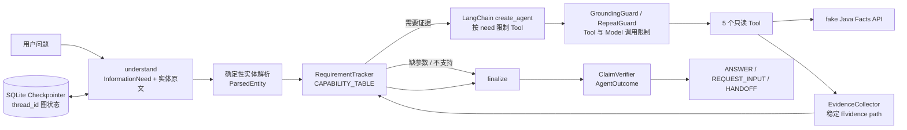

# Group Buy Agent

Group Buy Agent 是阶段 A 的拼团业务诊断原型：使用真实大模型理解用户需求，通过 5 个只读 Tool 查询订单、活动、资格、可加入团队和规则，并用可追溯 Evidence 约束最终结论。当前实现聚焦查询与诊断，不执行订单修改、退款到账确认等写操作或超出能力范围的任务。

## 阶段 A 架构



核心约束：Tool 参数必须来自用户原文解析出的可信实体或已有可信 Observation；FACT / RULE Claim 必须引用真实存在且类型匹配的 Evidence path。

## 启动方式

要求 Python 3.11 或更高版本。

```powershell
python -m pip install -e .
Copy-Item .env.example .env
```

在本地 `.env` 中填写真实的 OpenAI 兼容接口地址、模型名和 API Key，然后启动开发用 Facts 服务：

```powershell
python -m uvicorn fake_java.main:app --host 127.0.0.1 --port 8000
```

另开终端运行 CLI：

```powershell
python cli.py "订单 ORD100001 现在什么状态"
```

启动只提供 SSE 的 FastAPI 接口：

```powershell
python -m uvicorn api:app --host 127.0.0.1 --port 8080
```

使用 `curl -N` 关闭客户端响应缓冲，可以立即看到执行进度：

```powershell
curl.exe -N -H "Content-Type: application/json" `
  -d '{"session_id":"demo-session","message":"活动 100123 还有效吗"}' `
  http://127.0.0.1:8080/api/v1/chat/stream
```

`POST /api/v1/chat/stream` 接收 `session_id` 和 `message`。`session_id`
直接作为 LangGraph `thread_id`，因此 HTTP 请求之间继续使用 SQLite checkpoint
恢复会话。接口只返回 `text/event-stream`：

- `progress`：当前处于 `understanding` 或 `tool` 阶段；Tool 事件包含 Tool 名称。
- `final`：包含结构化 `kind`（`ANSWER`、`REQUEST_INPUT` 或 `HANDOFF`）和回答。
- `timeout`：完整请求超过总时限时返回 `HANDOFF`，随后关闭 SSE。

Facts HTTP Client 的 5 秒 timeout 约束一次下游 HTTP 操作；Agent 请求总 timeout
默认是 25 秒，覆盖理解、模型调用、Tool、重试和最终结构化输出的完整过程，可通过
`AGENT_REQUEST_TIMEOUT_SECONDS` 调整。测试用 fake Java 可设置
`FAKE_JAVA_DELAY_SECONDS=30`；默认值为 0，不影响正常运行和 Eval。延迟模式会维持
测试连接但推迟完整 JSON 响应，以便独立验证请求级总时限。

SSE 生成期间会轮询 `request.is_disconnected()`。客户端断开后，服务端停止生成事件、
取消当前 Agent task，并记录 `client_disconnected` 和 `cancelled`。这属于尽力取消，
已经在线程中执行的同步底层调用可能仍需自行结束。

需要跨进程继续同一会话时，复用同一个 `session_id`：

```powershell
python cli.py --session-id b1-demo "这个活动还有效吗"
python cli.py --session-id b1-demo "100123"
```

默认 checkpoint 文件为 `data/checkpoints.sqlite`，也可以通过
`--checkpoint-db` 或 `CHECKPOINT_DB_PATH` 指定其他磁盘路径。

运行完整真实模型评测：

```powershell
python -m evals.run
```

运行 B2 的真实 HTTP 集成测试：

```powershell
$env:RUN_B2_INTEGRATION = "1"
python -m unittest tests.test_b2 -v
```

## 当前评测结果

评测日期：2026-09-27。使用环境变量配置的真实 DeepSeek 模型，每条 Case 运行 3 次；每次使用独立 `session_id`，同一多轮 Case 的各轮复用该 `session_id`。

| 指标 | 结果 |
| --- | ---: |
| Case 总数 | 63 |
| 正式 Case | 63 |
| 单次通过 | 177 / 189（93.65%） |
| 单次通过率 Wilson 95% CI | 89.23%–96.33% |
| 3 次全过 | 58 / 63（92.06%） |
| 3 次全过率 Wilson 95% CI | 82.73%–96.56% |
| 平均 token | 3226.41 |
| 平均延迟 | 3.546 秒 |

Case 分类：参团诊断 12、订单 10、可加入团队 8、规则问答 10、能力不支持 8、参数 / 注入 6、多轮补参数 6、多轮状态隔离 3。6 条多轮补参数和 3 条多轮状态隔离 Case 本次均为 3/3 PASS。

## 已知限制

- 当前 ClaimVerifier 只能验证 Evidence path 存在和类型，不能确定自然语言 Claim 的语义是否真的被该 Evidence 支持。
- 规则检索与模型生成仍可能受问法影响；当前评测不使用 LLM Judge，只进行确定性校验。
- `fake_java` 和开发用户身份仅用于本地联调，不代表生产认证与真实业务数据。
- 系统是只读诊断 Agent，不能确认支付渠道退款到账，也不执行订单修改等写操作。
- 当前没有 Memory 或 RAG。

## Checkpointer 与 Store

Checkpointer 保存某个 `thread_id` 对应的 LangGraph State checkpoint。当前
SQLite checkpoint 包含 messages、understanding、parsed entities、requirement
status、pending needs、pending missing entities、Evidence 和 Outcome 等图状态。
图运行到 checkpoint 时将状态写入磁盘；下次使用相同 `thread_id` 调用时，
StateGraph 会从持久化状态继续执行。因此参数补充不依赖解析上一轮的自然语言回复。

Store 用于跨 thread 或更长期的应用记忆、用户记忆，不等于当前工作流的执行
状态。B1 只实现 Checkpointer，不实现 Store 或长期记忆。
